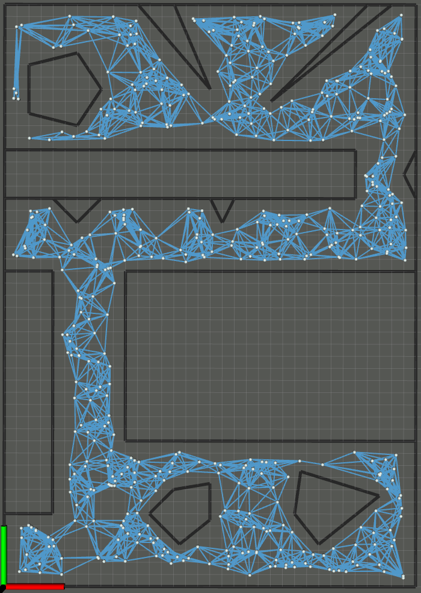

# Motion Planning in ROS from Scratch

## Overview

This project is in progress.

  Brief Package Descriptions:
  - `roadmap`: A package with tools to generate various types of graph structured Road Maps. Currently, it supports PRMs and Grids

  Planned additions:
  - Global Planning using Theta*, D* Lite, Potential Fields
  - Local Planning with DWA and MPC

  See the [Full API](https://rencheckyoself.github.io/motion-planning-in-ROS/) for more info.

## How to use

### Probabilistic Road Maps

To generate a PRM launch `roadmap view_prm.launch`. This will create a new PRM and visualize it in Rviz.

Change the parameters in `roadmap/config/map_params.yaml` to customize the components of the map.

The following image was taken using a cell size of 0.2m with a buffer radius of 0.15m.
The graph consists of 500 nodes trying to connect to the 10 nearest neighbors.

### Grids

To generate a grid, launch `roadmap view_grid.launch`. This will create a new grid and visualize it in Rviz.

Change the parameters in `roadmap/config/map_params.yaml` to customize the components of the map.

The following image was taken using a cell size of 0.2m with a buffer radius of 0.15m.
The grid has a 5 times finer resolution than the provided map, with black cells as the actual obstacle, gray cells representing cells inside the buffer zone, and white representing the free space.

### Heuristic Search on a Known Map (A* and Theta*)

To view the algorithm in action, launch `global_search plan_prm.launch`. This will create a PRM graph, apply A* and Theta* search to it, and visualize the results it in Rviz.

Change the parameters in `roadmap/config/map_params.yaml` to customize the components of the map.
Change the parameters in `global_search/config/search_params.yaml` to change the start and goal locations.

The following image was taken using a cell size of 0.2m with a buffer radius of 0.15m. The graph consists of 500 nodes trying to connect to the 10 nearest neighbors.
The green node is the start and the red node is the goal. The black line is the path determined by A* and the orange line is the path determined by Theta*.

### Iterative Search on an Unknown Map (LPA* and D* Lite)

To view the LPA* algorithm, launch `global_search plan_grid.launch`. This will create 2 grids, one using the stored obstacle data and one only accounting for the map boundary. LPA* is provided the empty grid and will plan an initial path between the start and goal locations. The known grid will be used to simulate a camera or some other sensor detecting a change in the environment, which will trigger LPA* to replan given the new information.

Change the parameters in `roadmap/config/map_params.yaml` to customize the components of the map.
Change the parameters in `global_search/config/search_params.yaml` to change the start and goal locations.

The following gif was taken using a cell size of 0.2m with a buffer radius of 0.15m and a grid resolution of 1.
The green node is the start and the red node is the goal, with the black line showing the final path determined by LPA* for the current map data. The faded area of the map is assumed by the search to be completely free and occupancy data is filled in one row at a time from the bottom up. Cells marked with a blue square indicate that it was updated during the most recent search.

## Background
