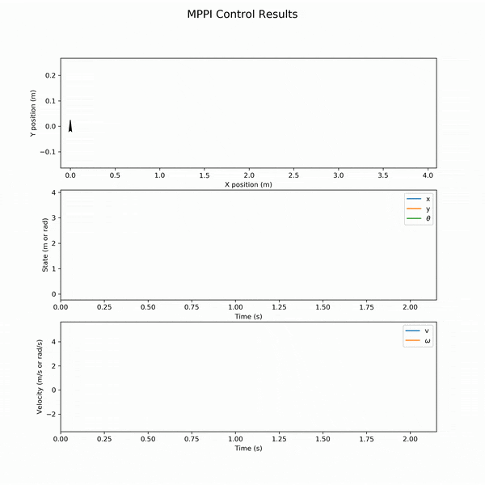

# Motion Planning in ROS from Scratch

## Overview

This project is in progress.


  Brief Package Descriptions:
  - `roadmap`: A package with tools to generate various types of graph structured Road Maps. Currently, it supports PRMs and Grids

  Planned additions:
  - Global Planning using Theta*, D* Lite, Potential Fields
  - Local Planning with DWA and MPC

  See the [Full API](https://rencheckyoself.github.io/motion-planning-in-ROS/) for more info.

## How to use

### Probabilistic Road Maps

To generate a PRM launch `roadmap view_prm.launch`. This will create a new PRM and visualize it in Rviz.

- Change the parameters in `roadmap/config/map_params.yaml` to customize the components of the map.

The following image was taken using a cell size of 0.2m with a buffer radius of 0.15m.
The graph consists of 500 nodes trying to connect to the 10 nearest neighbors.


### Grids

To generate a grid, launch `roadmap view_grid.launch`. This will create a new grid and visualize it in Rviz.

- Change the parameters in `roadmap/config/map_params.yaml` to customize the components of the map.

The following image was taken using a cell size of 0.2m with a buffer radius of 0.15m.
The grid has a 5 times finer resolution than the provided map, with black cells as the actual obstacle, gray cells representing cells inside the buffer zone, and white representing the free space.


### Heuristic Search on a Known Map (A* and Theta*)

To view the algorithm in action, launch `global_search plan_prm.launch`. This will create a PRM graph, apply A* and Theta* search to it, and visualize the results it in Rviz.

- Change the parameters in `roadmap/config/map_params.yaml` to customize the components of the map.
- Change the parameters in `global_search/config/search_params.yaml` to change the start and goal locations.

The following image was taken using a cell size of 0.2m with a buffer radius of 0.15m. The graph consists of 500 nodes trying to connect to the 10 nearest neighbors.
The green node is the start and the red node is the goal. The black line is the path determined by A* and the orange line is the path determined by Theta*.


### Iterative Search on an Unknown Map (LPA* and D* Lite)

To view the LPA* algorithm, launch `global_search lpastar_grid.launch`. This will create 2 grids, one using the stored obstacle data and one only accounting for the map boundary. LPA* is provided the empty grid and will plan an initial path between the start and goal locations. The known grid will be used to simulate a camera or some other sensor detecting a change in the environment, which will trigger LPA* to replan given the new information.

- Change the parameters in `roadmap/config/map_params.yaml` to customize the components of the map.
- Change the parameters in `global_search/config/search_params.yaml` to change the start and goal locations.

The following gif was taken using a cell size of 0.2m with a buffer radius of 0.15m and a grid resolution of 1.
The green node is the start and the red node is the goal, with the black line showing the final path determined by LPA* for the current map data. The faded area of the map is assumed by the search to be completely free and occupancy data is filled in one row at a time from the bottom up. Cells marked with a light blue square indicate that it was updated during the most recent search.


To view the D* Lite algorithm, launch `global_search dstarlite_grid.launch`. This will create 2 grids, one using the stored obstacle data and one only accounting for the map boundary. D* Lite is provided the empty grid and will plan an initial path between the start and goal locations. The known grid will be used to simulate a sensor mounted to the robot to detect a change in the environment within a given radius around the robot. This will trigger D* Lite to replan given the new information.

- Change the parameters in `roadmap/config/map_params.yaml` to customize the components of the map.
- Change the parameters in `global_search/config/search_params.yaml` to change the start and goal locations and the sensor range.

The following gif was taken using a cell size of 0.2m with a buffer radius of 0.15m, a grid resolution of 1, and a simulated sensor range of 0.6m.
The green node is the start and the red node is the goal and the robot is the blue cube. The black line represents the path the robot has taken and the orange line is the path determined by D* Lite for the current map data. The faded area of the map is assumed by the search to be completely free and occupancy data is filled as the simulated sensor is able to detect the cell. Cells marked with a light blue square indicate that it was updated during the most recent search.


### Potential Fields

To view the algorithm in action, launch `global_search plan_potential_fields.launch`. This will use the existing map data to plan a path from start to goal using the standard potential field algorithm. This implementation does not currently provide a means of escaping local minima and assumes a fully known map.

- Change the parameters in `roadmap/config/map_params.yaml` to customize the components of the map.
- Change the parameters in `global_search/config/search_params.yaml` to change the start and goal locations and potential field parameters.

The following gif was taken using a cell size of 0.2 with the following potential field parameters:
  ```
  att_weight: 0.6 # weighting factor the attactive component
  dgstar: 3 # piecewise threshold for attractive gradient
  rep_weight: 0.1 # weighting factor the repulsive component
  Qstar: 0.4 # obstacle range of influence
  epsilon: 0.05 # termination threshold
  zeta: 0.01 # step size
  ```
The green node is the start and the red node is the goal and the orange line is the path determined by the potential field algorithm.


### MPPI

To view the algorithm in action, launch `mppi_control turtlebot_mppi.launch`. After launching, call the `/start` service from the terminal to begin the waypoint following. This will apply the mppi control algorithm to calculate a control sequence to drive the robot to a series of waypoints. The parameters may need tuning to yield good results. This package depends on a couple of packages located in my other `ros_navigation_from_scratch` repo. Use the included .rosinstall file to ensure you get the correct packages.

- Change parameters in the mppi_control/config/control_param.yaml to tune the controller

Also included in `mppi_control/testing_files` is a python-only script to perform the same algorithm. To use this script, execute the `mppi.py` file. It is currently configured to have a unicycle model robot follow waypoints. Below are some results for various robots and tasks:

The first plot is using the unicycle kinematic model to solve the parallel parking problem. The output of the control algorithm is linear and angular velocities. See the python script for all of the parameters.



The plot below is using the differential drive kinematic model to solve the parallel parking problem. The output of the control algorithm is right and left wheel velocities. See the python script for all of the parameters.


The third plot is using the unicycle kinematic model to follow a series of waypoint. The output of the control algorithm is linear and angular velocities. See the python script for all of the parameters.


## Background

### Probabilistic Road Map

A PRM is a means to efficiently constructing a system of valid pathways through an environment as it has the advantage to plan in high dimensional configuration spaces. The assembly starts by randomly sampling states and only keeping them if they are a valid. In this implementation, a valid node is an x,y position that is not within the bounds of an obstacle or its buffer zone. After N number of valid nodes have been sampled each node is connected to it's k-nearest neighbors along valid straight line paths. In this implementation a path or edge is considered valid if it does not intersect an obstacle or it's buffer zone.

The challenging part of implementing a PRM is identifying how to determine if a node/edge is valid. This implementation currently only supports convex obstacles and expects that the vertices are provided in counterclockwise order. The collision detection is as follows:
- To determine if a sampled node is inside of an obstacle, test if the state is on the same side of all of the line segments.
- To determine if a sampled node is inside the buffer zone, calculate that shortest distance to each line segment and compare it to the desired buffer distance.
- To determine if an edge between two nodes is

## References and Resources

- LaValle, Steven M. Planning algorithms. Cambridge university press, 2006. Link

- Choset, Howie M., et al. Principles of robot motion: theory, algorithms, and implementation. MIT press, 2005.

- Latombe, Lydia E. Kavraki Jean-Claude. ”Probabilistic Roadmaps for Robot Path Planning.” Prati-
cal motion planning in robotics: current aproaches and future challenges (1998): 33-53.

- Daniel, Kenny, et al. ”Theta*: Any-angle path planning on grids.” Journal of Artificial In-
telligence Research 39 (2010): 533-579.

- Koenig, Sven, and Maxim Likhachev. ”Fast replanning for navigation in unknown terrain.”
IEEE Transactions on Robotics 21.3 (2005): 354-363.

- Williams, Grady, Andrew Aldrich, and Evangelos Theodorou. "Model predictive path integral control using covariance variable importance sampling." arXiv preprint arXiv:1509.01149 (2015).

- Abraham, Ian, et al. "Model-Based Generalization Under Parameter Uncertainty Using Path Integral Control." IEEE Robotics and Automation Letters 5.2 (2020): 2864-2871.
